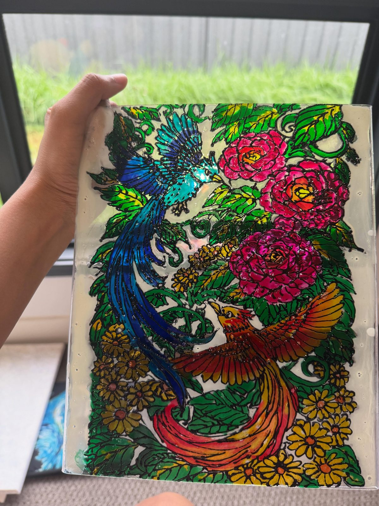

# ink & whiskers

A small, hand-built personal gallery site for [@ink_n_whiskers](https://www.instagram.com/ink_n_whiskers/) — a static site, no build step, no backend. Just paint, type, and a little hex-shaped joy.



## What's inside

```
ink-and-whiskers/
├── index.html       ← the page
├── styles.css       ← all the styles
├── script.js        ← cursor, scroll, lightbox
├── images/          ← her artwork
└── README.md
```

No frameworks. No `npm install`. Open `index.html` in a browser and it works.

## Hosting it on GitHub Pages

1. **Create a new GitHub repository.**
   Name it whatever you like — for example, `ink-and-whiskers`.

2. **Upload these files.**
   Drag every file from this folder (including the `images/` folder) into your repo. Or from the terminal:
   ```bash
   git init
   git add .
   git commit -m "first paint"
   git branch -M main
   git remote add origin https://github.com/<your-username>/<repo-name>.git
   git push -u origin main
   ```

3. **Turn on Pages.**
   In the repo on github.com → **Settings → Pages** → under *Build and deployment*, set **Source** to **Deploy from a branch**, pick `main` and `/ (root)`, then save.

4. **Wait ~30 seconds.**
   The site will be live at `https://<your-username>.github.io/<repo-name>/`.

That's it.

### Optional: use a custom domain

If your friend ever wants something like `inkandwhiskers.com`, point the domain's DNS at GitHub Pages and add it under **Settings → Pages → Custom domain**. GitHub has a free SSL certificate for it.

## Making it her own

Every change is just editing text in `index.html` — no rebuild needed, no special tools. Save the file, refresh the browser.

### Swap an artwork
1. Drop a new image into the `images/` folder.
2. In `index.html`, find the matching `<figure class="art" data-id="N">`.
3. Change `src="images/old-file.jpg"` to your new filename.
4. Update the title and meta below it.

### Update an artwork's caption (the words that appear when you click it)
Open `script.js`, find the `ART_DATA` block near the top, and edit the `title`, `caption`, and `meta` for the matching id.

### Change the bio
Open `index.html` and search for `"how it begins"` — the bio paragraphs are right below the heading.

### Change the colour palette
Open `styles.css` and edit the colour variables at the top (`--paper`, `--ink`, `--teal`, `--rose`, etc.). The whole site re-tints itself.

## Design notes

- **Typography:** Fraunces (variable display serif), Newsreader (editorial body), Caveat (the hand-written bits) — all loaded from Google Fonts.
- **Palette:** pulled directly from her actual paintings — deep teal, magenta rose, warm gold, emerald, blush, ink black.
- **Motifs:** hexagons throughout, a nod to her hex-canvas pour pieces.
- **Interactions:** ink-drop entry animation, paint-dot custom cursor, scroll-revealed sections, hex scroll progress, a small cat that peeks in halfway down, lightbox for each piece.
- **Responsive:** works on phones, tablets, and big screens. Honours `prefers-reduced-motion`.
- **Performance:** images compressed to ~300–400KB each (max 1600px on the long side), no external JS frameworks.

## Credits

Artwork © Hart (@ink_n_whiskers). Site built with care.
